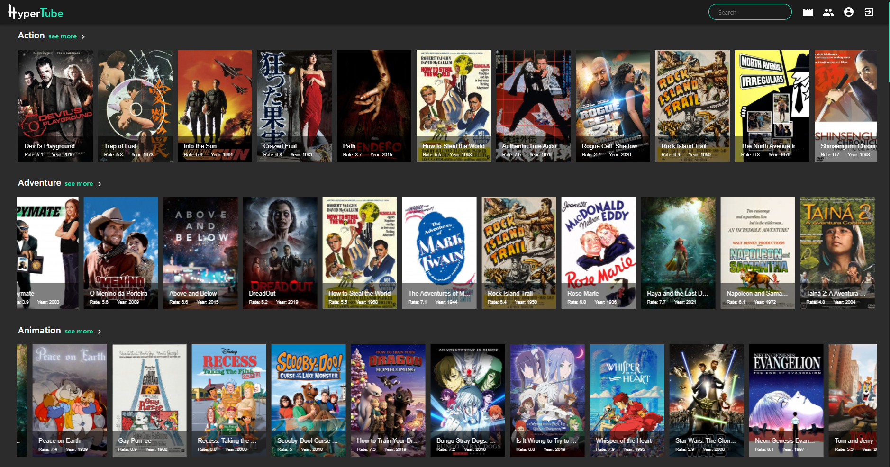
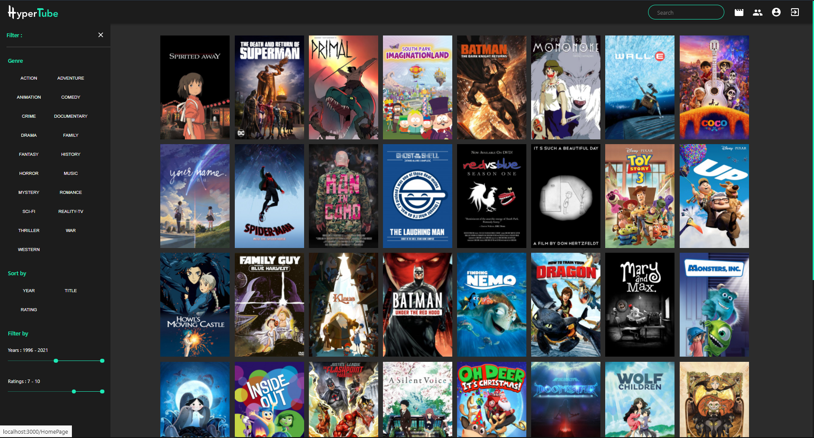
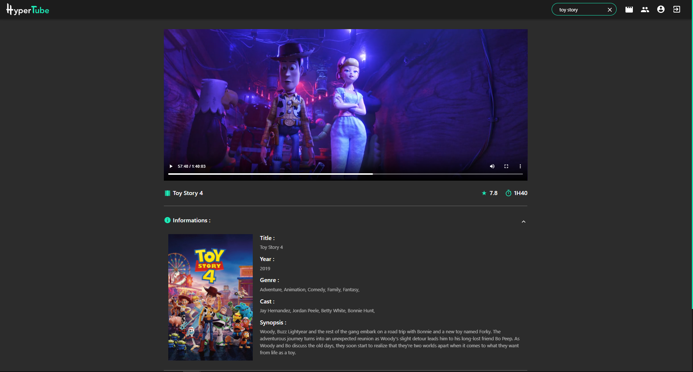

# HyperTube project

Popcorntime like app

**HyperTube is a streaming website allowing you to watch your favorite movies**

**Credit to: [Glorian Bikoumou](https://github.com/GlorianB) - [Valentin Rossi](https://github.com/Valar207) - [Alexandre Soysavanh](https://github.com/alexsoysavanh)**





## Tech Stack

- Server: **NodeJS** - Framework **Express**
- Client: **ReactJS** - **MaterialUI** - **SASS**
- DB: **MongoDB**
- Architecture: Client-Server - **RESTful API**

## Dependencies

To start this website you need to have installed `nodejs`

### Launch app

go to client root and run

```shell
npm install
npm start
```

go to server root and run

```shell
npm install
npm start
```

### Documentation

Once the server is running, API documentation is available at http://localhost:5000/api-docs/

## Requirements

You will need a .env file in server directory

```
PORT=5000
SITEURL=...
NODEMAILER_USER=...
NODEMAILER_PASSWORD=...
JWT_SECRET=...
DEFAULT_USER_IMAGE=https://cdn.pixabay.com/photo/2015/10/05/22/37/blank-profile-picture-973460_1280.png
DB_URL=mongodb+srv://<username>:<password>@cluster0.sj8fw.mongodb.net/hypertube?retryWrites=true&w=majority
OAUTH_GOOGLE_CLIENT_ID=...
OAUTH_GOOGLE_CLIENT_PASSWORD=...
OAUTH_42_CLIENT_ID=...
OAUTH_42_CLIENT_PASSWORD=...
COOKIE_KEY=...
```
